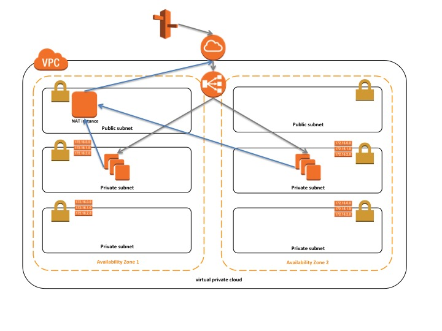

# Deploy a sinatra app

### Setup local environment

Use vagrant and virtualbox to provision the local environment, so we can have a working environment setup quickly.    
The Image used for this application is centos7 vagrant box, which can be downloaded from here: https://app.vagrantup.com/centos/boxes/7

The centos7 vagrant box version: v1708.01  
The virtualbox version: 5.1.28

Edit `local_vagrant_settings.rb`

local_vagrant_settings has defined the vagrant box, CPU and Memory required and the ports required mapping to the guest machine.

By default port 80 from the vagrant machine has mapped to port 8000, therefore, once the server is up, you can access the website at http://127.0.0.1:8000

To get the vagrant box up and running, go to the root directory of this repository and type command:  

```
$ vagrant up
```
**Troubleshooting**

For mount shared folder error:  
`vagrant plugin install vagrant-vbguest`


**Ansible playbook and roles**

Why use ansible as config management tool?
Ansible is quick to setup and running in local and AWS environment
Ansible roles can be reused in both environment

Vagrant will run with playbook-vagrant.yml with below roles:  
- local:  
  Install the basic dependencies
- ruby:  
  Install ruby package
- unicorn:  
  Install and config unicorn
- proxy:  
  Install and config nginx to work as a reverse proxy
- app:  
  Copy the app files to the target location

**Run system tests**

```
$ cd /repo/tests/system
$ bundle install
$ rake spec

```

**Test app**

```
curl 127.0.0.1
```

### Setup AWS environment

**Prerequisite**

The assumption is, you already have an AWS VPC setup in your AWS account, and you should have following architecture in your VPC



Can use AWS Net Gateway instead of a Net Instance

Network ACL:  
- Inbound:  
Allow TCP Port 80 - 443  
Allow SSH Port 22  

Security Groups:  
- ELB-sg: allow HTTP 80  
- Jumpbox: allow TCP 22  
- App-sg: allow TCP 22 from jumpbox sg, allow HTTP 80 from ELB-sg  

Route table:  
- For Public subnets:  
  10.0.0.0/16 local  
  0.0.0.0/0   igw-x  

For private subnets:  
10.0.0.0/16 local  
0.0.0.0/0   nat-x  

Edit `aws_settings.yml` with above settings


**S3 bucket policy**  

ELB logging bucket:

```
{
    "Sid": "ElbAccountAccess",
    "Effect": "Allow",
    "Principal": {
        "AWS": "arn:aws:iam::783225319266:root"
    },
    "Action": "s3:*",
    "Resource": [
        "arn:aws:s3:::<elb-logging>/*",
        "arn:aws:s3:::<elb-logging>"
    ]
}
```

Application artefact bucket:

```
{
    "Sid": "AccountAccess",
    "Effect": "Allow",
    "Principal": {
        "AWS": "<account id>"
    },
    "Action": "s3:*",
    "Resource": [
        "arn:aws:s3:::<app-bucket>/*",
        "arn:aws:s3:::<app-bucket>"
    ]
}
```

Configuration artefact bucket:

```
{
    "Sid": "AccountAccess",
    "Effect": "Allow",
    "Principal": {
        "AWS": "account id"
    },
    "Action": "s3:*",
    "Resource": [
        "arn:aws:s3:::<app-bucket>/*",
        "arn:aws:s3:::<app-bucket>"
    ]
}
```

**Install this package**

$ virtualenv venv

$ source venv/bin/activate

$ pip install -r requirements.txt

$ pip install -e .


**Run unittest**

$ python -m unittest tests.test_cf_generator


**Run the stack**

Require aws credetials setup locally  
Require the user having permissions on CloudFormation, EC2, Security Groups and etc.

```
$ stack -i aws_settings.yml
```

The command will generate the CloudFormation template from the config you supplied, and launch the stack with that template.  
The template will be stored locally at /tmp/my_template.json  
Note, this template will be overrided each time you run the command

Reason for choosing Troposphere to generate CloudFormation template?

I'm familiar with Cloudformation template, and Troposphere enable me to inject config variables into the template via python.
Also, I can unit test the cloudformation template in json pieces, prior to launching the stack.

**Ansible playbook and roles**

Userdata will run with playbook-aws.yml with below roles:  
- aws:  
  Install the basic dependencies
- ruby:  
  Install ruby package
- unicorn:  
  Install and config unicorn
- proxy:  
  Install and config nginx to work as a reverse proxy
- app:  
  Copy the app files to the target location


### Build AWS AMI to install the basics prior to app deploy

Require packer installed

```
scripts/build_ami.sh <>
```

This command will launch an ec2 instance from the base AMI you specified, and run Ansible on that instance, once the provision finished, it will create an AMI from that instance. There will be a snapshot of the instance generated.

### Security uplift

Securiy part has implemented on AWS environment only, because the local environment require faster boot and feedback

- Use nginx official YUM repo instead of epel-release
- Remove unnecessary software packages
- Remove unneeded services
- Update the system with latest security patches
- Enable selinux

**SELinux to function on Amazon AMI Linux**

`yum -y install policycoreutils selinux-policy-targeted`

Edit `/etc/grub.conf`

```
title Amazon Linux 2017.09 (4.9.51-10.52.amzn1.x86_64)
root (hd0,0)
kernel /boot/vmlinuz-4.9.51-10.52.amzn1.x86_64 root=LABEL=/ console=tty1 console=ttyS0 selinux=1 security=selinux enforcing=1
initrd /boot/initramfs-4.9.51-10.52.amzn1.x86_64.img
```

Rebuild the initrd image so that selinux settings can take effect.

```
yum -y update
touch /.autorelabel
/sbin/new-kernel-pkg --package kernel --mkinitrd --make-default --dracut --depmod --install 4.9.51-10.52.amzn1.x86_64 || exit $?

rpm -q --scripts kernel
```


Edit `/etc/selinux/config`

```
# This file controls the state of SELinux on the system.
# SELINUX= can take one of these three values:
#     enforcing - SELinux security policy is enforced.
#     permissive - SELinux prints warnings instead of enforcing.
#     disabled - No SELinux policy is loaded.
SELINUX=enforcing
# SELINUXTYPE= can take one of these two values:
#     targeted - Targeted processes are protected,
#     mls - Multi Level Security protection.
SELINUXTYPE=targeted
```

Require reboot at the end.
